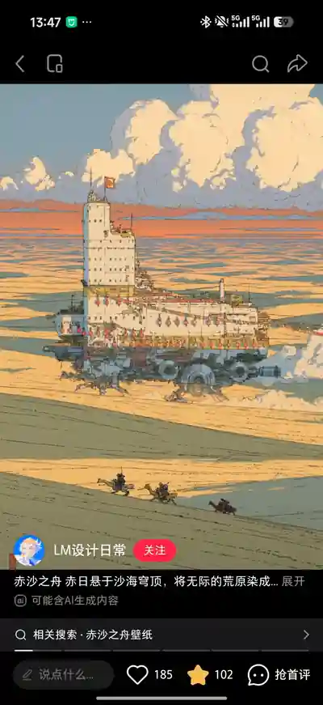
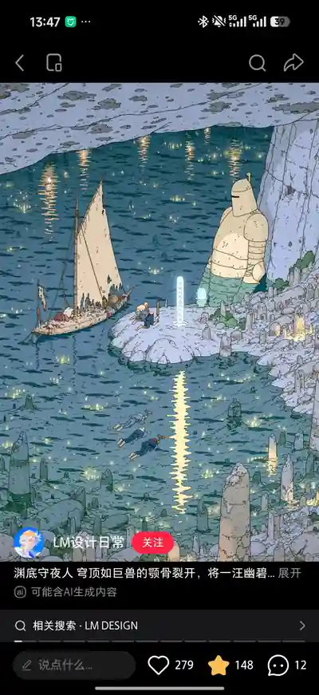

# Crashmon 美术与表达方向 v1

更新日期：2026-09-25。设计状态：Draft（方向已接受，制作规格待样张确认）。本轮仅归档设计与参考，不表示正式美术已制作或替换到游戏中。

确认依据：项目发起人提出“宇宙探索背景”，明确“抽象”是有梗、幽默而不是抽象艺术；随后提供沙海巨型载具与发光水域遗迹两张截图，并要求将这套设计思路落成文档、附图上传。具体地图、宠物名字、配色数值和首章方案仍是提案。

关联：[首次体验](first-session.md)、[二维据点原型](hub-prototype.md)、[1.0 大纲](../versions/1.0/outline.md)、[首章题材与内容提案](../versions/1.0/universe-content-proposal.md)、[参考图来源与使用边界](references/README.md)。

## 1. 一句话方向

> 诗意的复古宇宙探索，住着一些认真生活、行为有点离谱的伙伴。

内部简称可用“法式宇宙冒险绘本风”。这只是沟通标签，不是对参考图出处、作者或艺术流派的鉴定。实际制作以本文的线条、配色、构图、角色和可读性要求为准。

世界提供奇观、旅行感与适度神秘；Crashmon 通过性格、动作和技能带来幽默。场景不是笑话背景板，宠物也不是网络表情贴图。可爱是基础，古怪是记忆点，关键时刻保留帅气与温暖。

本轮推进顺序调整为：在已有体验原型上明确题材与视觉方向，先验证少量样张，再逐步替换占位素材。不再将“暂不考虑题材和画风”视为当前禁令，也不因此停止玩法验证或立即量产整套美术。

## 2. 用户参考图

下图是用户截图的等比压缩预览，保留完整画面与平台信息；未裁剪、未重绘。原始截图均为 940 × 2048，仓库预览为 400 × 871。它们用于设计对照，不是 Crashmon 原创作品、可发布素材或授权证明。来源说明见[参考目录](references/README.md)。

### R01：沙海中的大型载具

观察要点：奶油沙色与灰蓝构成大色面，橙色集中在天际和装饰；细线描绘机械与生活设施；巨型主体与小旅人形成尺度差；大片天空和地表给密集建筑留出呼吸空间。借鉴的是尺度、留白、细线与生活气息，不是复刻这艘载具或截图构图。

### R02：发光水域与遗迹

观察要点：深青水面与浅灰紫岩壁对照，少量暖光形成观看路径；大而安静的构造物与小尺度行动相映衬；场景既陌生又适合停下来观察。借鉴的是冷暖关系、巨大遗存与安静氛围，不是照搬石像、人物或具体建筑。

两张截图无法证明真实作者、原创出处、制作方式或素材许可；不将它们标为某位艺术家的作品。截图中显示的账号与平台提示只作为来源线索记录，不替代核实。

## 3. 提炼，而不是照搬

| 维度 | 保留的方向 | 转化为游戏画面时的处理 |
| --- | --- | --- |
| 线条 | 细而清楚的手绘轮廓、适量结构线 | 角色外轮廓略强，背景内线更弱；避免缩小后全部变成噪点 |
| 色彩 | 粉尘感、柔和大色块、克制冷暖对比 | 给主体和交互点留下明度差；不把低饱和做成低可读性 |
| 光影 | 以局部色和少量分层阴影塑形 | 不依赖复杂反射、重度泛光或写实材质 |
| 世界 | 巨型机械、异星地貌、旧设施与旅行者 | 把大奇观放在远景或地标，实际活动区保持清楚 |
| 细节 | 使用痕迹、修补、挂件、零件等生活感 | 细节集中在少数驻足点，不平均铺满所有地面 |
| 情绪 | 辽阔、神秘、安静，夹杂荒诞 | NPC 和伙伴制造笑点，风景允许认真而漂亮 |

此前“圆润漫画太空喜剧”中的角色亲和力可以保留；过粗轮廓、全场高饱和塑料感、密集笑话不作为本轮默认方向。场景与宠物仍共享线条、色彩和材质语言，不能拼成两款游戏。

## 4. 场景：奇观与可玩空间分层

沿用已确认的二维俯视、略带正面的角色和建筑，不因插画参考改成全 3D、纯侧视或复杂自由相机。参考图的透视不能直接作为可行走地图。

建议按三层组织：远景或不可进入的大地标承担奇观；建筑、岩壁和植物承担场所特征；道路、可走地面与交互区保持最简洁。画面的细节密度随功能变化，不要求每个角落达到宣传插画级别。

据点可以表现为一座停泊的科考船旁的生活区。即使外观是巨大移动设施，首版也可以静态停泊，不由美术设定自动引入驾驶、动态地形或多人载具系统。陌生感来自轮廓、比例、生态和远景，不必靠大地图面积。

将生活感集中在少数对象：修补过的旗帜、晾着的工作服、尺寸不合的零件、有人认真维护的旧仪器。避免平均堆满齿轮、管线、符号和无法交互的装饰。

具体地面、建筑和前景需要按统一视角绘制，并明确遮挡、碰撞与角色落脚点。建筑遮住角色时用轮廓提示、透明或分层遮挡解决；导航和服务器判定来自明确地图数据，不从一张生成插画里猜测。

## 5. 配色与线稿工作基线

下表是便于做第一轮样张的近似建议，不是从截图精确取样，也不是已经批准的最终调色板。

| 色彩用途 | 候选色 | 应用建议 |
| --- | --- | --- |
| 纸白、旧漆、浅色建筑 | `#F0E1BC` | 提供温暖而不刺眼的大面积亮部 |
| 沙地、岩面与暖光 | `#D6B879` | 与冷阴影形成层次，避免所有物体同色 |
| 远景、阴影和天空 | `#819DA8` | 降低背景竞争，衬托角色 |
| 水体、设备暗面 | `#2F6872` | 提供稳定暗部与夜景底色 |
| 岩壁、遗迹和暮色 | `#ADAEC4` | 给冷景增加层次，不做统一紫色滤镜 |
| 少量装饰和强调 | `#D37B5D` | 旗帜、队伍识别和关键物件的局部点缀 |
| 线稿与正文 | `#36464B` | 轮廓不必全用纯黑，文字仍需充分对比 |

不同区域可在同一组基础关系上变化：室外偏沙色与灰蓝，水域偏深青与浅灰紫。宠物可使用更鲜明的局部颜色，但不要靠全身荧光色才能从场景中辨认。

轮廓、结构线、纹理线分级。缩到真实游玩尺寸后消失的结构，应简化或移到详情立绘，不用无限提高贴图分辨率补救。纸感或颗粒只能轻量使用，不能覆盖文字、血条或交互标记。

## 6. 主角与 Crashmon：来自同一个世界

主角使用易辨认的宇航服或旅行装备：简洁的头盔、背包、少量补丁和一个个人识别色。短比例是工作建议，不需要把所有角色画成极端大头。共享据点中要能区分自己的角色、其他玩家与 NPC，不能只靠姓名文字或颜色。

每只 Crashmon 至少具有一个清晰的主轮廓、一个身体记忆点和一个招牌动作。场景可以细，地图小精灵应更简；战斗图与图鉴图保留同样的比例、关键特征和配色，不是每次重新设计。

示例仅用于说明设计方法：

| 候选性格 | 视觉与动作 | 能力与成长如何呼应 |
| --- | --- | --- |
| 爱装凶却会打喷嚏的小龙 | 喷火后自己后退半步，但关键时刻认真出击 | 输出效果可以明确有力；进化保留招牌喷嚏，不凭空变成无关造型 |
| 胆小但愿意保护伙伴的甲兽 | 随身抱着盖板，平时躲藏，队友遇险时主动站出来 | 防护定位与性格一致；进化强调主动保护，而不只是体积变大 |
| 坚持住进不合尺寸零件的小蟹 | 拖着过大的壳，停下时整理自己的房子 | 护盾或防护倾向有直观来源，不为笑点强制引入装备系统 |

名字、技能和种族映射见[内容提案](../versions/1.0/universe-content-proposal.md)。这些不替换已有 A/B/C 的稳定定义 ID，不重置玩家已经领取的伙伴；后续换表现和真正的规则变更必须分开处理。

## 7. 幽默：世界认真，生物有点不正经

“抽象”在本项目指有梗、幽默、轻微荒诞，不是抽象几何艺术，也不是随机荒诞覆盖所有规则。

优先使用三种表达：角色反复出现但会变化的小习惯；正经设施或说明与眼前行为的反差；玩家交互引发的短小反应。例如“全自动”设备旁有机器人在手摇发电，甲兽恢复体力时把盖板也放到治疗台上。

一个场景有一个主要笑点即可，允许探索、夜景和进化时刻安静下来。笑话应来自当地生态和角色，不依赖短期热梗、真实人物表情、素材拼贴或处处嘲笑玩家。可选图鉴记录可以更活泼，必读任务提示优先清楚。

规则与玩家权益不承担喜剧代价。不能突然不执行技能、偷走正式资产、伪造存档成功或把关键按钮藏起来。技能名字可以有趣，目标、效果、消耗和持续时间必须准确；笑点可以跳过，不能改变结算。

## 8. 战斗、界面与声音

战斗背景继承当前区域的颜色和地标，但降低细节与对比，把行动者、目标、状态和捕捉入口放在第一阅读层。普通动作简短；强烈形变、抖动和漫画符号留给关键事件，不让每次攻击都变成长演出。

界面建议采用“调查笔记 + 老式科考仪器”的轻量组合。边框、纸张、编号和印章作为少量识别元素，文字保持清晰；不把完整界面做成仿旧纹理，不铺满玻璃卡片、赛博霓虹或粗重装饰框。

探索时保留精简队伍信息、当前目标和菜单入口，中心区域留给移动。多人姓名、NPC 提示和主角标识需要不同层级。窄屏压缩非关键面板而不是等比缩小所有文字；危险、选择和可捕捉状态至少同时使用形状或文字，不只依靠颜色。

声音可尝试温暖合成器、稀疏旋律和轻巧打击乐；笑点用短音效点到即止，不做网络梗音效合集。音频方向为提案；没有音乐或配音也应能理解关键状态。保留音量与减少非必要动态表现的设计空间。

## 9. 从概念图到可用资源

概念插画和游戏资源是两类交付。前者表达气氛，后者必须有明确视角、尺寸、透明边缘、锚点、分层、状态与使用位置。不能把完整插画一张铺进地图就称为完成美术，也不能把参考截图加入运行时资源目录。

第一轮先做一个实际游戏镜头：据点出生点、NPC、三只候选、出口、可走道路、两位其他玩家与最小 HUD。视角和布局对齐现有原型。再做一只宠物的地图/战斗/图鉴对照，以及一张双宠战斗表现样张；无需先画整颗星球。

候选资源拆分：背景远景、地面与道路、建筑主体、前景遮挡、可交互物、角色、效果、界面。只在有明确复用需求时建立模块，不先建设通用素材生产平台。

由人类确认一组比例、色彩、线稿、表情和视角基准后，Agent 才按同一参考继续生成或整理。各版本必须复用已批准的基准，而不是每位设计者重新解释“法式”“可爱”或“高级”。动作完成度可以先用少量姿态、位移和形变验证，不预先承诺所有生物的全方向逐帧动画。

资源文档记录稳定 ID、表现版本、用途、来源、审批状态和必要技术规格。截图只用于讨论；正式资源必须有独立的来源与使用依据。生产引用与 docs 中的参考图分开管理。

## 10. 视觉验收与本轮不做项

下表是未来验收规格，不表示已经执行或通过。

| 编号 | 场景 | 验收关注 |
| --- | --- | --- |
| ART01 | 据点正常游玩尺寸 | 一眼找到自己、引导 NPC、出口和可走路线；不依赖放大原图 |
| ART02 | 同一镜头多名玩家 | 他人与环境不遮蔽关键交互，自己的角色有稳定识别方式 |
| ART03 | 同一宠物的地图、战斗与图鉴 | 轮廓、关键身体特征、比例与颜色一致，小图仍能辨认 |
| ART04 | 双宠战斗与技能演出 | 行动者、目标、血量、状态与捕捉机会优先于背景和笑点 |
| ART05 | 台词、命名和动作 | 幽默来自角色，不影响规则理解；移除梗后核心玩法仍成立 |
| ART06 | 窄屏、菜单与遮挡 | 文字可读，关键按钮可操作，关闭面板后能恢复移动 |
| ART07 | 新版本作者追加内容 | 与批准样张具有共同视觉语言；新内容不擅自改公共主题或稳定 ID |
| ART08 | 资源打包与出处核对 | 不打包用户截图、平台标识或来源不明的参考素材；实际大小和加载表现另行测量 |

本轮不制作正式角色资源、不重绘地图、不迁移渲染引擎、不实现战斗、不改变共享据点与存档行为。正式美术替换需另行安排实现任务及运行验证。

## 11. 下一次确认

先确认一张真实游玩构图的据点样张，再确定首章地貌、昼夜配色、角色轮廓与第一批资源规格。首章题材和候选种族继续在[内容提案](../versions/1.0/universe-content-proposal.md)讨论；通用战斗规则仍归[核心规则](core-rules.md)，不在美术文档中发明新的技能结算。
