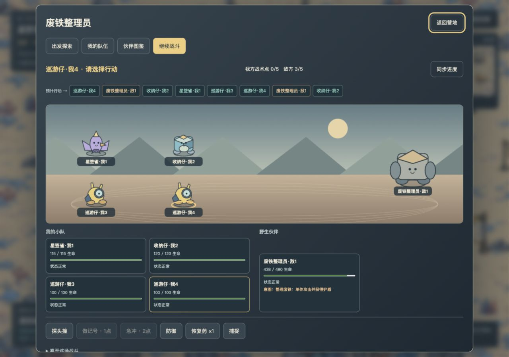
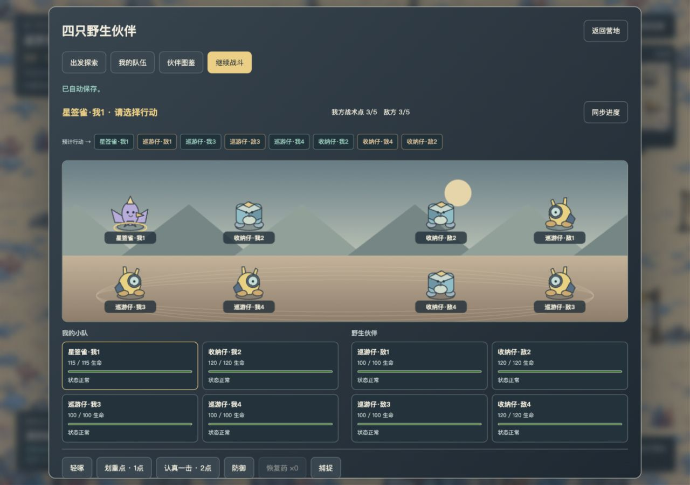
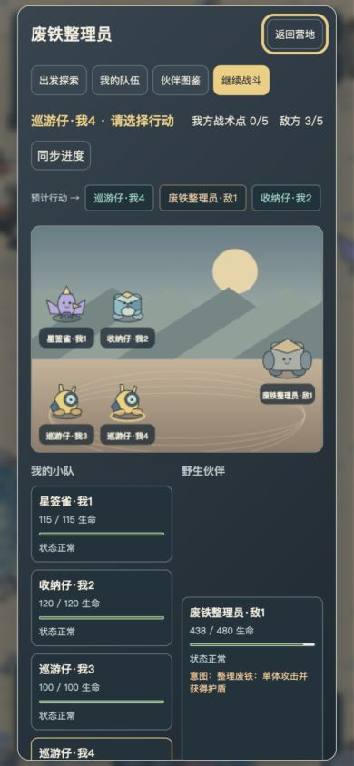
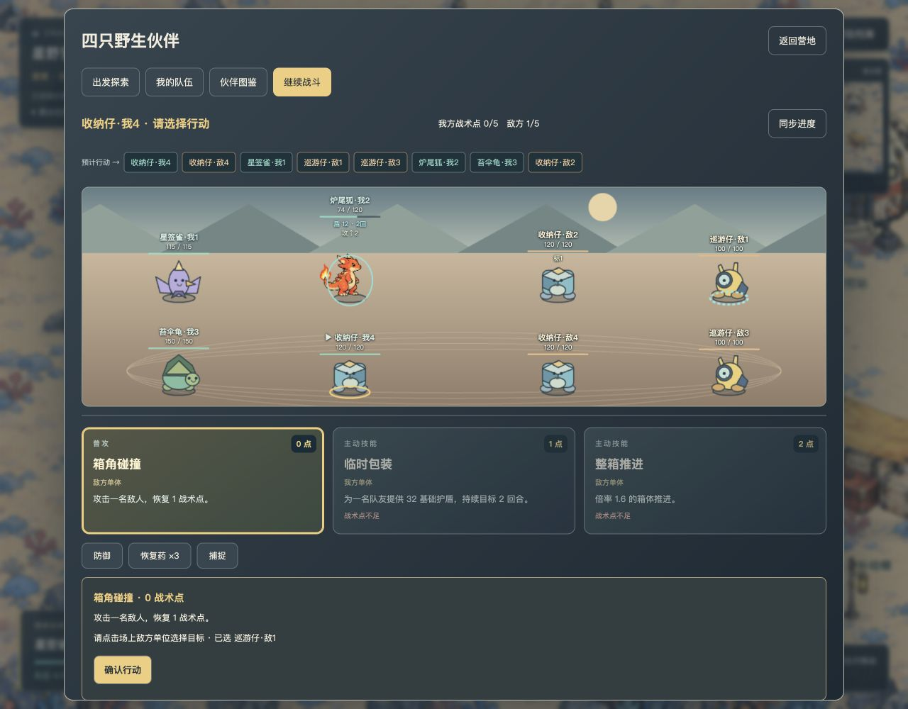
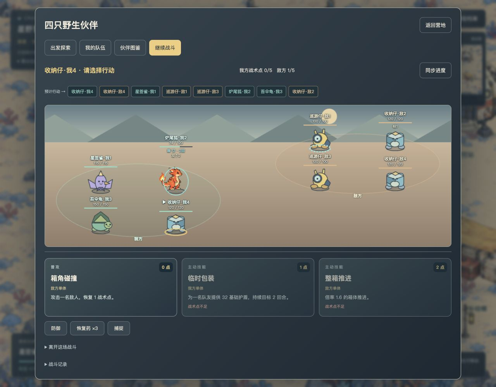
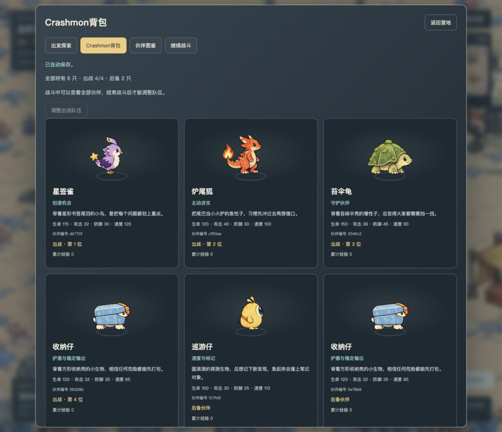

# B0 战斗与五只伙伴验收记录

日期：2026-10-06。环境：macOS、Node.js 25.8.0、Codex 内置浏览器。基线提交：`69c18be0efde0fa8ccc945bb9844bbc562ba37fc` 加本轮工作区；未创建提交或推送。最终运行源码摘要见[候选文件清单](battle-2026-10-06/source-sha256.json)。

实施由三名 Astra medium subagent 分别负责内核与内容、后端与资产、前端；本记录由主 Agent 独立运行检查和浏览器操作后编写。所有数据库均为临时隔离数据，未打开或迁移仓库原有 `data/` 存档。

## 验收结论

初版本地 PvE 框架已达到本轮交付范围：三选一、五种伙伴定义及技能、教学和普通捕捉、1–4 队伍、连续速度行动、共享战术点、护盾与状态、首领、永久捕获和战斗恢复均已接通。

五只为炉尾狐、苔伞龟、星签雀、巡游仔、收纳仔，均有中文角色设计、轮廓/配色、性格、栖息地、获取、定位与弱项、普攻及两个主动技能。前三只保留 `starter_a/b/c`；后两只来自野生捕捉。正文见[内容索引](../content/pets/README.md)。

## 自动化与独立检查

- 基线 `npm test`：21/21。最终 `npm test`：45/45，0 失败、0 跳过，约 15.7 秒。故障注入产生的内部存储错误日志属于预期场景。
- `npm run check` 与 `git diff --check`：通过。最后一次仅修前端演出去重后，另行检查两个前端模块语法并浏览器复核。
- 核心覆盖：150/100/75 时间轴与平局、变速、取整、护盾寿命、标记多段与刷新、灼烧开始死亡、非法指令不消耗、捕捉资源、AI 与首领循环、统一终局清理。
- API 覆盖：账号隔离、旧行动与幂等、六条教学路径、一次补给、捕获/结算/回执故障回滚、满队后备、重启、超时、版本/技术故障挂起冻结、首胜与补球唯一。
- 主 Agent 用基线提交的真实旧 `store.js` 创建 v2 临时数据库，包含已领取苔伞龟、会话和领取回执，再用当前代码升级 v3。实例 ID、归属、队伍位置和原会话保留；原 requestId 返回原回执，未重复发宠。
- 主 Agent 独立纯内核运行：种子 24，三初始 × 两教学，全部通过普攻压血并捕获；分别需 3 或 4 次玩家行动，最低剩余生命 48。六种初始/野生双宠 × 两普通遭遇，采用可用强攻优先、低于 40% 血量使用恢复药策略，12/12 获胜，总行动数 11–24。
- 同策略双宠对首领 6/6 战败，说明目前不适合标为双宠入门挑战；已把建议队伍改为三至四只。此为策略样本，不能据此断言没有双宠通关解法。

## 真实浏览器与 HTTP 流程

1. 浏览器登录合成账号，从营地移动到引导员，比较并确认领取星签雀，打开探索与五宠图鉴。
2. 领取一次 10 球 3 药；进入收纳仔教学。满血捕捉目标禁用并解释半血条件；普攻后每次减少 23 HP，敌人正常响应。
3. 将目标压至 51/120 后刷新，自动恢复相同生命与当前行动，再成功教学捕获。正式球仍为 10，收纳仔自动成为第二位队员。
4. 通过真实 HTTP 行动接口进行普通巡游遭遇，10 次玩家指令后捕获两只巡游仔，形成四只队伍。共消耗 4 球、2 药，胜利补 1 球，背包为 7 球 1 药。重启服务后浏览器确认四只实例及原队员经验保留。
5. 浏览器进入首领战，星签雀标记后巡游仔急冲，资源 3→2→0，首领 480→438，标记被消耗；资源不足技能禁用。刷新和服务重启都恢复该战斗。
6. 390×844 窄屏下，页面宽 390、对话框 clientWidth 与 scrollWidth 均 350；四只头像、标签完整，滚动后可提交防御。敌方整理废铁造成伤害并取得 30 盾，预告更新为蓄力。浏览器未观察到 JS 错误。
7. 用 HTTP 指令继续首领至胜利，观察到群攻，总行动 33；原队员各得首胜合计 50 经验、补 1 球，终局所有临时状态与护盾清除。[结果](battle-2026-10-06/http-boss-result.json)。
8. 浏览器检查四对四阵型后，用 HTTP 指令完成战斗：17 次玩家行动、全场 25 次行动获胜，一只己方倒下；原队员各得 20 经验并补 1 球。同一请求重发得到完全一致回执。[结果](battle-2026-10-06/http-four-v-four-result.json)。

HTTP 连续行动是可复现的客观状态验收，不能替代人类操作手感评价；并未声称所有战斗均由鼠标逐步打完。

## 发现并修复

- 自动推进曾停在敌方 awaiting 阶段，已修复至下一玩家输入边界。
- 首领意图字段未接上、内部首领 ID 出现在卡片，已修正。
- 四宠下排名称被裁切；同种实例难辨认。现使用完整双排布局与统一阵营槽号。
- 切入新战斗沿用旧滚动位置，现仅切页或换场回顶部。
- 单纯选择技能会重复播放旧攻击，现按战斗 ID 与 revision 去重演出。
- 放弃/超时与正常终局清理不一致，现共享清理逻辑并增加回归用例。

## 首轮截图（界面调整前）

## 追加验收：头顶血条、场上点选与技能卡

按用户后续要求，战斗角色卡已移除。生命数值、细血条、护盾和状态短标直接悬浮在本体头顶，无底板、边框、圆角或卡片阴影。当前行动者和选中目标由脚底圈及小箭头区分；技能保留为独立卡片。此次仅调整前端表现和界面文档，未改战斗规则。

主 Agent 在独立临时数据库、localhost:3138 合成账号验收；四人队伍含三种初始与收纳仔，由测试夹具构造，用于覆盖不同轮廓和护盾。未对用户正在玩的 3137 战斗发送行动。

- 1280×1000：四对四头顶信息不重叠；实际点击画面中的角色本体后选中对应目标，并启用确认。最终无底板版本再次验证本体点选。
- 浏览器实际提交划重点、振作、撑伞；目标标记、攻击提升、受击生命和剩余护盾正确更新。Enter 可选中场上队友并确认护盾。战术点不足技能明确禁用。
- 390×844：文档宽 390、弹层 clientWidth/scrollWidth 均为 350；8 个场上目标按钮、0 个旧角色卡、3 张技能卡。纵向滚动可访问技能；未观察到浏览器警告或错误。无状态四对四舞台约 492px，随状态与护盾增加留白。
- HUD 按各物种绘制高度定位，避免矮个单位的血条被同排其他角色的状态推远。完整状态及持续回合保留在悬停提示和无障碍标签中。
- 最终两个前端模块 `node --check` 和 `git diff --check` 通过。本次未重复执行后端全套测试；前述 45 项为初版规则验收证据。
- 已重启并刷新 3137 页面加载新版；沿用原临时数据库，继续恢复用户当前首领战。

窄屏截图：[战场](battle-2026-10-06/mobile-overhead-ui.jpg)、[技能卡片](battle-2026-10-06/mobile-skill-cards.jpg)。

## 追加验收：阵营站位区分

按用户要求进一步拉开己方与敌方站位。桌面改为我方左下、敌方右上，各自最多 2×2，中场留出空白；窄屏改为敌方上区、我方下区，各自最多 2×2，阵营间留白并有淡色地面环与“敌方／我方”标签。单个敌人居中所属阵营。头顶 HUD 保持透明，点击层与绘制共用布局。

主 Agent 在原独立 UI 测试存档检查 1280×1000 四对四及 390×844 窄屏：双方清楚分区，8 个单位及头顶信息无重叠；实际点击窄屏敌方巡游仔本体后选中正确实例。文档宽 390，弹层内容宽 350，无横向溢出，浏览器未观察到警告或错误。两个前端模块语法及差异检查通过。重启 3137 后只读检查原首领战，单首领居中敌方区域，原战斗进度保留；未提交战斗行动。

其他截图：[窄屏阵营](battle-2026-10-06/mobile-formation.jpg)、[首领分区](battle-2026-10-06/boss-formation.jpg)。前面的截图保留为此前界面阶段记录。

## 追加验收：点击目标即释放与 Crashmon 背包

用户要求取消额外的“确认行动”，并增加全部持有伙伴背包。Astra medium subagent 修改前端客户端、样式和界面说明；主 Agent 使用新的独立临时数据库验收。当前已有的新伙伴图片与演出继续复用，本次不作为新增美术交付。

- 选“划重点”后点击己方只显示非法目标原因，未推进；点击敌方收纳仔后立即施加标记，行动推进至炉尾狐，战术点 3→2，没有确认按钮。
- 选“振作”后仍等待点自身；双击炉尾狐后仅执行一次，战术点 2→1、行动推进至苔伞龟。直接读取隔离库的回执，只有一次标记和一次振作记录，无非法目标或双击多余提交。
- 选“撑伞”再点己方收纳仔，立即赋予 36 护盾并推进至下一个行动者。覆盖敌方、自身与友方三类释放。
- 测试夹具提供 6 个持有实例，其中 4 出战、2 后备。背包完整显示 6 张卡片及 6 个不同编号，两只同种收纳仔分别列出；战中调整按钮禁用。
- 营地独立入口在战斗进行中仍直接打开背包，不会强制跳回战斗。390×844 下页面宽 390、弹层内容宽 350，无横向溢出；全部 6 张卡仍可滚动查看。浏览器没有警告或错误日志。
- 客户端 `node --check` 与 `git diff --check` 通过。本次未新增机械式 UI 测试，也未重跑战斗内核全套测试。未知请求重试、幂等与自动恢复沿用既有机制；本次未重复做网络故障注入。
- 3137 已加载新版，恢复原演示档案，首领战进度保留，并打开其背包。验收操作未向该原战斗提交行动。

[手机背包截图](battle-2026-10-06/mobile-backpack.jpg)。本次前端文件摘要见 [即时释放与背包候选清单](battle-2026-10-06/instant-cast-backpack-sha256.json)。

## 尚未验收或不在本轮

这是单进程本地 PvE。多人共享据点的旧测试通过，未实现合作战斗、PvP 或公开部署。野外是遭遇卡片，尚无完整可探索野外地图。成长当前为固定战斗值与经验记账，没有升级、进化或正式经济平衡；无被动是五只入门内容的明确选择。

本轮没有真人乐趣评估、手机实机、长期运营、负载、多服务器及灾难恢复演练；基础值、奖励、24 小时放弃和正式开放权益仍需后续确认。B01–B30 是完整规格清单，本记录只证明列出的场景；不把全部规格标为已通过。
